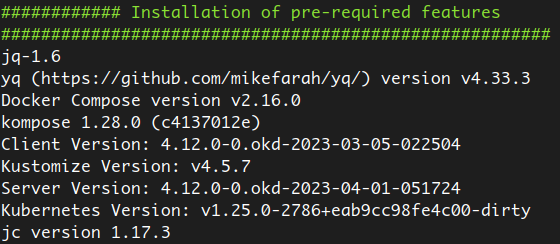

# Scripts de conversion Docker vers Kubernetes


## Contexte initial

Le but initial de ce repo était de rassembler différents scripts bash, python, ansible visant à normaliser et convertir un fichier docker-compose.yml en manifests k8s avec différentes options telles que la gestion des env_file et des secrets. 

Ces scripts ont été développés dans le cadre d'un POC piloté par le Service Infrastructure et Réseau, qui visait initialement à porter des applications professionnelles de l'Abes fonctionnant sous Docker vers Kubernetes sans régressions. OKD, le projet upstream d'Openshift, a été choisi comme distribution k8s.

## JRES 24
Le comité d'organisation des [JRES24](https://2024.jres.org/) (Rennes, 10-13 décembre 24) ayant validé notre proposition ["Vers la symphonie des conteneurs"](https://2024.jres.org/programme#modal-23), nous avons avons ajouté à ce repo l'ensemble des éléments qui ont été nécessaires à la conception de l'[article](documentation/article_jres24.md) et du [poster](documentation/files/poster-jres-2024.jpg).

La version [1.0](https://github.com/abes-esr/jres2024-okd/releases/tag/1.0) script [compose2manifests.sh](compose2manifests.sh) a été complété pour répondre à un cas d'usage plus global, apportant des fonctionnalités supplémentaires telles que:
  * l'installation de pré-requis
  * la recherche automatiques des hôtes Docker
  * la vérification de la connectivité des hôtes 
  * l'installation des clés ssh
  * la recherche dynamiques des ports applicatifs
  * la copie de persistentVolumes
  * l'installation de drivers CSI
  * le traitement des PV en multi attachements
  * le calcul dynamique des taille des PV
  * le support des montages NFS
  * etc...

La version [2.0](https://github.com/abes-esr/jres2024-okd/releases/tag/2.0) apporte le support du CI/CD Openshift (sur le cluster) ainsi que le build de l'image en local.

L'utilisation et la description des fonctions de ce script sont détaillées [ici](documentation/compose2manifests_functions.md).

La documentation détaillée relative à l'article et à OKD/Openshift peut être consultée à partir de ce [menu](documentation/README.md).

Pour être pertinent, ce script a été testé avec succès pour la conversion d'une multitude de cas potentiellement différents de docker-compose.yml, notamment les applications suivantes

- [qualimarc](https://github.com/abes-esr/prada-docker)
- [theses](https://github.com/abes-esr/theses-docker)
- [movies](https://github.com/abes-esr/movies-docker)
- [abesstp](https://github.com/abes-esr/abesstp-docker)
- [item](https://github.com/abes-esr/item-docker)

### Cas d'usage du déploiement de l'application Qualimarc
Vidéo d'exemple d'utilisation du script 1.0 avec [Qualimarc](https://qualimarc.sudoc.fr)

https://vimeo.com/1022133270/90cfd9e0a7 

### Cas d'usage du déploiement de l'application Abesstp après le build d'une image 
Vidéo d'exemple d'utilisation du script 2.0 avec [AbesSTP](https://stp.abes.fr)

 https://vimeo.com/1037464417.

 Ce cas inclut la construction d'une image suivant un contexte de build avec Openshift ou en local.

### Initialisation et utilisation de compose2manifests.sh
Cette procédure ne nécessite qu'un simple fichier docker-compose.yml et du .env correspondant dans le répertoire courant. 
Il faut comme prérequis les paquets (la procédure est indépendante de l'OS GNU/Linux)
- jq
```bash
sudo wget https://github.com/jqlang/jq/releases/latest/download/jq-linux-amd64 -O /usr/local/bin/jq &&  sudo  chmod +x /usr/local/bin/jq
```
- yq
```bash
sudo wget https://github.com/mikefarah/yq/releases/latest/download/yq_linux_amd64 -O /usr/local/bin/yq &&  sudo  chmod +x /usr/local/bin/yq
```
- docker-compose
```bash
sudo wget https://github.com/docker/compose/releases/latest/download/docker-compose-linux-aarch64 -O /usr/local/bin/docker-compose &&  sudo  chmod +x /usr/bin/local/docker-compose
```
- kompose
```bash
sudo wget https://github.com/kubernetes/kompose/releases/latest/download/kompose-linux-amd64 -O /usr/local/bin/kompose &&  sudo  chmod +x /usr/local/bin/kompose
```
- jc
```bash
sudo wget -q https://github.com/kellyjonbrazil/jc/releases/download/v1.25.3/jc-1.25.3-linux-x86_64.tar.gz -O /usr/local/bin/ | tar xzf - |chmod +x /usr/local/bin/jc
```
- moreutils
```bash
# el
dnf config-manager --set-enabled powertools powertools
dnf config-manager --set-enabled powertools crb
dnf install moreutils -y 
# debian/ubuntu
apt install moreutils -y
```

L'inventaire des versions logicielles est indiqué en début de script:



Ensuite il suffit d'exécuter simplement:
```bash
chmod +x compose2manifests.sh
./compose2manifests.sh 
```

pour obtenir les manifests k8s correspondant: deployment et services.

Pour déployer l'appli dans OKD/k8s:
```bash
export KUBECONFIG=~/orchidee_install/auth/kubeconfig
oc apply -f "*.yaml"
oc get all

```
#### Options du script

```bash
./compose2manifests.sh [ prod || test || dev || local ] [ appli_name ] [default || '' || secret || env_file | copy | help] [kompose] [helm]

```

- **$1** dev|test|prod: environnement sur lequel récupérer le .env. Local: fournir manuellement les '.env' et 'docker-compose.yml'

- **$2** appli_name: nom de l'application à convertir

- **$3** default or '' : Generates cleaned appli.yml compose file to plain k8s manifests

- **$3** env_file: Generates cleaned advanced appli.yml with migrating plain 'environment' to 'env_file' statement, will be converted into k8s configmaps

- **$3** secret: The same as env_file, in addition generates advanced appli.yml with migrating all vars containing 'PASSWORD' or 'KEY' as keyword to secret, will be converted into k8s secrets

- **$3** copy: only run PVCs copy staff

- **$4** kompose: Converts appli.yml into plain k8s manifests ready to be deployed with 'kubectl apply -f *.yaml

- **$5** provider: 'kubernetes'(default) produces deployment files or openshift produces deploymentConfig and imageStream files

- **$6** helm: Kompose option that generates k8s manifest into helm skeleton for appli.yml

- exemples
```bash
./compose2manifests.sh prod item secret kompose helm
./compose2manifests.sh local qualimarc secret kompose helm
./compose2manifests.sh local abesstp copy
./compose2manifests.sh test movies env_file kompose openshift
```
