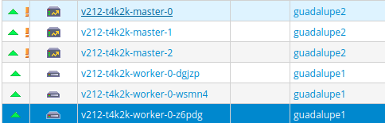

# Installation de OKD 4

## Environnement

OKD a été installé premièrement sous la plateforme de dev d\'ovirt 4.4
<https://air-dev.v106.abes.fr> dans la version 4.7

La documentation de base spécifique à ovirt est ici:
<https://docs.okd.io/latest/installing/installing_rhv/installing-rhv-default.html>

## Installation

Il faut d\'abord installer le client `oc` récupéré ici
<https://github.com/openshift/okd/releases> On l\'installe par exemple
dans `/usr/local/bin`

    $ wget https://github.com/okd-project/okd/releases/download/4.12.0-0.okd-2023-02-18-033438/openshift-client-linux-4.12.0-0.okd-2023-02-18-033438.tar.gz
    $ tar xvzf openshift-client-linux-4.12.0-0.okd-2023-02-18-033438.tar.gz
    $ mv oc /usr/local/bin/

On va chercher la dernière version d\'okd

    $ oc adm release extract --tools quay.io/openshift/okd:4.12.0-0.okd-2023-02-18-033438

Ou bien :

    $ https://github.com/okd-project/okd/releases/download/4.12.0-0.okd-2023-02-18-033438/openshift-install-linux-4.12.0-0.okd-2023-02-18-033438.tar.gz

Avant de lancer l\'installateur, il y a besoin de choisir deux adresses
IP statiques:

     * Internal API virtual
     * Ingress virtual

\... qu\'il faut impérativement renseigner sur lilas dans la zone
`v212.abes.fr` ainsi:

``` bash
rndc freeze v212.abes.fr in internal
vi /var/named/chroot/var/named/v212.abes.fr.db
...

$ORIGIN orchidee.okd-dev.abes.fr.
api A 10.34.212.49
api-int 10.34.212.49
$ORIGIN apps.orchidee.okd-dev.abes.fr.
*.apps 10.34.212.39
...
rndc thaw v212.abes.fr in internal
```

**Si cette cette étape n\'est pas fonctionnelle au niveau DNS,
l\'installation échouera sur un timeout.**

Création d\'un fichier de configuration à l\'api d\'ovirt

``` /bash
tee ~/.ovirt/ovirt-config.yaml <<EOF
ovirt_url: https://ovirt.example.com/ovirt-engine/api 
ovirt_fqdn: ovirt.example.com 
ovirt_pem_url: ""
ovirt_username: admin@internal
ovirt_password: super-secret-password 
ovirt_insecure: true
EOF
```

On crée un fichier d\'installation dans le but de le modifier avant
l\'installation.

``` /bash
$ openshift-install create install-config --log-level=info (--dir okd_install)
```

On modifie le fichier en fonction des valeurs `$API` et `$APPS` rentrées
précédemment.

``` /bash
yum install -y moreutils
sudo wget https://github.com/mikefarah/yq/releases/latest/download/yq_linux_amd64 -O /usr/bin/yq &&  sudo  chmod +x /usr/bin/yq
CIDR='10.34.212.0/23'; API='10.34.212.49'; APPS='10.34.212.39'
yq eval -o json install-config.yaml | jq ".networking.cidr = \"$CIDR\"" \
                                    | jq ".platform.ovirt.api_vips = \"$API\"" \
                                    | jq ".platform.ovirt.ingress_vips[0] = \"$APPS\"" \
                                    | yq eval -P - | sponge  install-config.yaml
```

Puis on lance l\'installateur:

``` /bash
$ openshift-install create cluster --log-level=info (--dir okd_install)
```

Répondre aux questions de l\'installateur:

    [root@vm2-dev ~]# ./openshift-install create cluster
    ? SSH Public Key /root/.ssh/id_rsa.pub
    ? Platform ovirt
    ? Engine FQDN[:PORT] air-dev.v100.abes.fr
    INFO Loaded the following PEM file:               
    INFO    Version: 3                                  
    INFO    Signature Algorithm: SHA256-RSA             
    INFO    Serial Number: 4096                         
    INFO    Issuer: CN=air-dev.v100.abes.fr.97246,O=v100.abes.fr,C=US 
    INFO    Validity:                                   
    INFO            Not Before: 2019-07-08 17:06:50 +0000 UTC  
    INFO        Not After: 2029-07-06 17:06:50 +0000 UTC   
    INFO    Subject: CN=air-dev.v100.abes.fr.97246,O=v100.abes.fr,C=US 
    ? Would you like to use the above certificate to connect to Engine?  Yes
    ? Engine username admin@internal
    ? Engine password [Press Ctrl+C to switch username, ? for help] **********
    ? Cluster Default
    ? Storage domain SanPedroSAS
    ? Network backend-dev
    ? Internal API virtual IP 10.34.212.49
    ? Ingress virtual IP 10.34.212.39
    ? Base Domain abes.fr
    ? Cluster Name v212
    ? The container registry pull secret for this cluster, as a single line of JSON (e.g. {"auths": {...}}).
    X Sorry, your reply was invalid: invalid character 'y' looking for beginning of value
    ? Pull Secret [? for help] **********************************************
    INFO Obtaining RHCOS image file from 'https://builds.coreos.fedoraproject.org/prod/streams/stable/builds/33.20210117.3.2/x86_64/fedora-coreos-33.20210117.3.2-openstack.x86_64.qcow2.xz?sha256=887cc36518ef2e2a80fa83dc9a0f67748adca8d3bf7c824b81afe0cc8b1d23b9' 

    INFO Creating infrastructure resources... 

NB: Il y a besoin d\'une clé pour obtenir l\'image de fedora coreos
qu\'on copie depuis cette adresse:
<https://cloud.redhat.com/openshift/install/pull-secret>

L\'installation prend environ 40 minutes et aboutit par défaut sur la
création de 6 VMs dans ovirt:



L\'installation terminée, les données de connexion s\'affichent à
l\'écran, et on peut les retrouver à tout moment dans
`.openshift_install.log`

    time="2021-03-11T08:12:35+01:00" level=info msg="Install complete!"
    time="2021-03-11T08:12:35+01:00" level=info msg="To access the cluster as the system:admin user when using 'oc', run 'export KUBECONFIG=/root/auth/kubeconfig'"
    time="2021-03-11T08:12:35+01:00" level=info msg="Access the OpenShift web-console here: https://console-openshift-console.apps.v212.abes.fr"
    time="2021-03-11T08:12:35+01:00" level=info msg="Login to the console with user: \"kubeadmin\", and password: \"my_password\""
    time="2021-03-11T08:12:35+01:00" level=debug msg="Time elapsed per stage:"
    time="2021-03-11T08:12:35+01:00" level=debug msg="    Infrastructure: 5m16s"
    time="2021-03-11T08:12:35+01:00" level=debug msg="Bootstrap Complete: 16m7s"
    time="2021-03-11T08:12:35+01:00" level=debug msg="               API: 1m52s"
    time="2021-03-11T08:12:35+01:00" level=debug msg=" Bootstrap Destroy: 37s"
    time="2021-03-11T08:12:35+01:00" level=debug msg=" Cluster Operators: 18m34s"
    time="2021-03-11T08:12:35+01:00" level=info msg="Time elapsed: 41m58s"

## Installation personnalisée

Il est possible de personnaliser l\'installation:

-   nombre de noeuds
-   CPU
-   RAM
-   etc\...

<https://docs.okd.io/latest/installing/installing_rhv/installing-rhv-customizations.html#installing-rhv-customizations>

Il faut créer pour cela un fichier de configuration
`install-config.yaml`

``` /bash
additionalTrustBundlePolicy: Proxyonly
apiVersion: v1
baseDomain: okd-prod.abes.fr
compute:
  - architecture: amd64
    hyperthreading: Enabled
    name: worker
    platform:
      ovirt:
        affinityGroupsNames:
          - compute
    replicas: 3
controlPlane:
  architecture: amd64
  hyperthreading: Enabled
  name: master
  platform:
    ovirt:
      affinityGroupsNames:
        - controlplane
  replicas: 3
metadata:
  creationTimestamp: null
  name: orchidee
networking:
  clusterNetwork:
    - cidr: 10.128.0.0/14
      hostPrefix: 23
  machineNetwork:
    - cidr: 10.35.102.0/23
  networkType: OVNKubernetes
  serviceNetwork:
    - 172.30.0.0/16
  cidr: 10.34.212.0/23
platform:
  ovirt:
    affinityGroups:
      - description: AffinityGroup for spreading each compute machine to a different host
        enforcing: true
        name: compute
        priority: 3
      - description: AffinityGroup for spreading each control plane machine to a different host
        enforcing: true
        name: controlplane
        priority: 5
    api_vips: 10.34.212.49
    ingress_vips:
      - 10.34.212.39
    ovirt_cluster_id: 71d7ddcf-8a6f-4cc5-82a3-df836b701576
    ovirt_network_name: okd-prod
    ovirt_storage_domain_id: 8ade67b3-f232-444a-ad42-5ac43b129b05
    vnicProfileID: fe77d0f4-3697-4ef5-8283-784c1f3cd64e
publish: External
pullSecret: ''
sshKey: |
  ssh-rsa 
```

## Destruction

**/!\\ DANGER /!\\**

Attention, cette commande efface tout le cluster sans moyen de
récupération

    openshift-install destroy cluster
