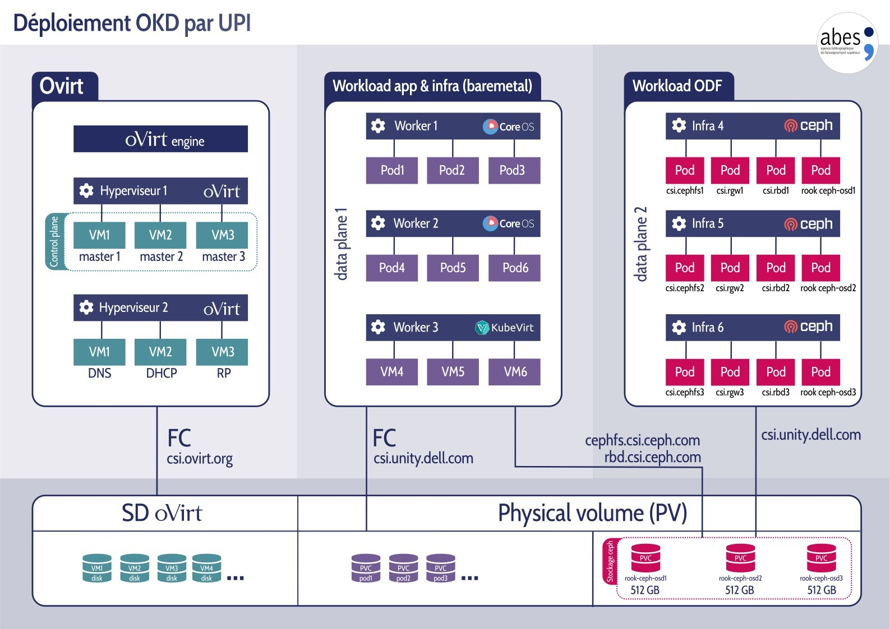

# JRES 24: Vers la symphonie des conteneurs

### Résumé 

Le service Infrastructure de [l'Abes](https://www.abes.fr/) gère le
cycle de vie de près de 300 conteneurs Docker, mais la gestion manuelle
est rapidement devenue complexe. C'est dans ce contexte que nous avons
étudié au moyen d'une preuve de concept la possibilité d'utiliser un
orchestrateur de conteneurs sur la base de Kubernetes. L'une des
contraintes les plus fortes était de garantir a minima le m*ême niveau
de fonctionnalité* de nos applications conteneurisées avec Docker. La
courbe d'apprentissage de Kubernetes étant élevée, nous avons choisi
d'utiliser ou de développer différents outils pour automatiser et
faciliter la migration.

Cet article, qui n'a pas vocation à être exhaustif, traite de la mise
en œuvre d'un POC, de l'installation de l'environnement aux
perspectives d'avenir, en passant par la conversion automatisée de nos
applications professionnelles au moyen de l'utilisation de notre script
[compose2manifests](https://github.com/abes-esr/jres2024-okd/blob/main/compose2manifests.sh).

### Mots-Clefs

OKD, Openshift, Kubernetes, Docker, docker-compose, conteneurs, pods,
CRI-O, orchestration, kompose, jq, deployment, persistentVolume,
automatisation, Github, devops, ODF, Ceph, ingress

# Introduction

En charge de fournir l'infrastructure nécessaire au développement et à
la production des applications professionnelles fournies par
[l'Abes](https://www.abes.fr/), le Service Infrastructure et Réseau
(SIRE) s'efforce de mettre à disposition des plateformes modernes en
adéquation avec les besoins pour le développement et l'hébergement des
solutions informatiques proposées.

Le projet de virtualisation généralisée vers les outils de devops, qui
s'appuie sur l'orchestration des conteneurs à l'aide
d'Openshift/OKD, constitue une illustration de cette démarche.

Cet article n'a pas pour ambition de couvrir exhaustivement tous les cas
d'usage de Kubernetes. Son objectif est plutôt d'offrir un premier
aperçu concret à toute personne envisageant d'adopter cette technologie.

L'expérimentation a permis de démontrer le déploiement d'une application
Docker dans un environnement k8s, avec un fonctionnement parfaitement
équivalent.

Tout au long de cet article , des compléments plus techniques renvoyant
à la documentation importée du wiki de l'Abes peuvent être consultés
comme annexe sur :
<https://github.com/abes-esr/jres2024-okd/tree/main/documentation>

# État des lieux

## Un environnement virtualisé

Jusqu'en 2019, l'environnement virtualisé de l'Abes comprenait 300 VMs
réparties sur trois environnements dev/test/prod et quinze serveurs KVM
sous le gestionnaire de virtualisation [oVirt](https://www.ovirt.org/).
Notre CI/CD reposait sur Jenkins et Puppet. Les applications
professionnelles étaient déployées sous Tomcat au moyen de l'outil
interne KAT (KeepAlived/Apache/Tomcat), Apache étant le *reverse proxy*.

## La conteneurisation

Depuis, alors que les applications à usage interne ont fait l'objet
d'une migration dans le *cloud*, les applications professionnelles ont
été systématiquement conteneurisées sous Docker. Quant au CI/CD, il
repose désormais sur la chaîne GitHub actions -- DockerHub, avec un
déploiement des containers sur des hôtes virtuels Docker en interne.

Cette pratique a entraîné un nombre exponentiel de containers qui sont
tous gérés manuellement : nous sommes ainsi passés progressivement de
trois hôtes Docker dev/test/prod à dix-huit nœuds Docker pour des
centaines de containers, avec des besoins en ressources et espace disque
en constante augmentation. Par ailleurs, bien que restant fiable, notre
infrastructure [oVirt](https://www.ovirt.org/) initiale a perdu de sa
pertinence du fait d'une baisse constante du nombre des VMs nécessaires
au profit des nœuds Docker.

## Vers l'orchestration

Dès lors, une démarche d'orchestration des containers est devenue
indispensable, avec l'objectif principal de contrôler de façon
centralisée le cycle de vie de l'ensemble de containers d'une ou de
plusieurs applications.


*1. Architecture de l'infrastructure de l'Abes passée, présente et potentielle*

### CI/CD

#### Contexte

La politique informatique *opensource* de l'Abes prévoit non seulement
de mettre à disposition le code de ses applications professionnelles,
mais aussi d'utiliser dans la mesure du possible les outils proposés par
le *cloud .*

Ainsi, notre environnement de CI/CD repose principalement sur la paire
[GitHub](https://github.com/abes-esr) et
[DockerHub](https://hub.docker.com/u/abesesr).

#### GitHub

Il comporte deux types de *repositories* pour chaque application :

-   <app>-front et <app>-api :

    Ils contiennent le code java et le Dockerfile pour *builder* les
    images.

-   <app>-docker :
    Il contient le README.md et le docker-compose.yaml nécessaire pour
    lancer l'applicationPour leur part, les GitHubs actions 
    automatisent le *build* et le *versionning* des images à partir des
    sources et du Dockerfile avant de les pousser dans Dockerhub.

#### Dockerhub 

Dockerhub est le registre public des images des applications de l'Abes
qui sont appelées dans le docker-compose.yml.

#### Docker-compose.yml

C'est donc le docker-compose.yaml issu du *repository* <app>-docker
qui est l'élément à analyser pour lancer l'application en question.

Il contient les éléments essentiels suivants sous le format yaml :

-   noms des services ;

-   repository dockerhub de l'image ;

-   ressources allouées ;

-   ports exposés ;

-   variables d'environnement.

Il s'agit des données suffisantes (mais non exhaustives) pour décrire la
façon dont le *runtime [15]* - ici Docker - exécute l'application, à
l'aide d'un ou plusieurs containers interagissant les uns avec les
autres en tant que services unitaires.

# Lancement d'un POC 

## Objectifs

Les objectifs définis dans le cadre de ce POC (*Proof of Concept*)
étaient de choisir l'orchestrateur le mieux adapté à nos besoins,
d'installer un cluster et de tester l'import sous Docker des
applications professionnelles pré-existantes.

## Choix d'un orchestrateur

Grâce à la veille informatique menée par le SIRE et à notre
participation à différents congrès, nous nous sommes intéressés aux
solutions d'orchestration de containers tels que Kubernetes, devenu la
référence en la matière, et intégré dans la totalité des offres *cloud
public -* AKS (Azure), EKS (Amazon), GKS (Google).

L'objectif était également d'opter pour une solution conforme à la
politique informatique de l'Abes, et principalement :

-   la normalisation et la portabilité des applications ;

-   la possibilité d'une version *on-premise* ;

-   le caractère *open source* ;

-   la présence d'une communauté active.

    Pour choisir notre orchestrateur, la compatibilité avec l'*Open
    Container Initiative (OCI) [12]* a également été l'un de nos
    critères pour garantir la standardisation de nos applications. C'est
    en effet l'objectif de l'OCI qui décrit des formats d'industrie
    d'images, de distribution et de *runtime [15]* de containers.
    C'est ainsi que Docker a reversé à l'OCI runC [14] son format de
    *runtime* ainsi que son format d'image Docker.

Objectivement, la version Vanilla de Kubernetes offrait déjà bon nombre
de ces critères. Cependant, elle comportait le défaut d'être
particulièrement difficile à mettre en œuvre. Dans la mesure où
l'objectif était de tester la portabilité des applications
conteneurisées depuis Docker - et non de passer du temps à installer le
logiciel, nous avons privilégié OKD qui nous offrait une facilité de
mise en œuvre.

## Fonctionnement

À l'image d'[oVirt](https://www.ovirt.org/) avec les machines
virtuelles, l'orchestration a pour objectif de gérer, au moyen d'un
moteur, le cycle de vie d'une grande quantité de *pods* ou de conteneurs
en les répartissant sur différents nœuds en fonction de différents
critères (CPU, ram, affinité, etc ...).

La grande différence d'un conteneur par rapport à une VM réside dans le
fait que les conteneurs sont conçus pour avoir une durée de vie courte.
De ce fait, Kubernetes fonctionne sur la base de *templates*
(*deployments*) en charge de contrôler les réplications (*replicaset*)
dans le but de recréer des *pods* plutôt que de les redémarrer ou de les
migrer à chaud. Cependant, les nœuds *workers* doivent faire appel à des
volumes persistants (PV) créés par des pilotes de stockage (CSI). Cette
agilité d'exécution donne la possibilité de dimensionner automatiquement
les ressources (*autoscaling*) soit en ajustant le nombre de *pods*
(*horizontal scaling*), soit en ajustant les ressources nécessaires au
*pod* en question (*vertical scaling*). Le *scaling*
[[wiki]](https://github.com/abes-esr/jres2024-okd/blob/main/documentation/scaling.md)
est possible pour les *pods*, les nœuds *master* ou *worker* sur la base
de *triggers* de déclenchement pré-définis.


*2. Horizontal Autoscaling vs Vertical autoscaling*

## Installation d'OKD [2] [[wiki]](https://github.com/abes-esr/jres2024-okd/blob/main/documentation/Installation.md)

### Présentation

OKD/Openshift est la version communautaire de *Redhat Openshift*,
entièrement bâtie sur Kubernetes dont Redhat est un des principaux
contributeurs. OKD/Openshift propose une méthode d'installation
universelle (mode UPI) sur *cloud*, environnements virtuels ou *bare
metal*, ainsi qu'une méthode automatisée (IPI) permettant la création
automatique des VMs nécessaires sur les *clouds* supportés dont oVirt
fait partie.

Au moment de l'installation, la version proposée d'OKD était la 4.13.
Dans la suite de cet article, nous désignerons nos *clusters* OKD par le
nom « orchidee ».

### Pré-requis

Contrairement à Openstack ou AWS, oVirt est une plateforme de
virtualisation qui n'offre pas de service DNS ou DHCP, ce qui nécessite
un service en parfait état de marche.

Le DNS joue un rôle crucial et doit être capable de résoudre les
*wildcards* - « *apps.orchidee.okd.abes.fr », notamment le point
d'entrée du cluster « api.orchidee.abes.fr »

De plus, n'offrant pas de service DHCP, il convient de configurer une
plage d'adresses dynamiques sur un *vlan* dédié à la communication
*inter-pods*.
[[wiki]](https://github.com/abes-esr/jres2024-okd/blob/main/documentation/Installation.md)

### Installation en mode Installer-provisionned Infractructure (IPI)

Il s'agit de la façon la plus simple d'installer et de mettre à jour un
*cluster* OKD puisqu'il installe de manière transparente les VMs de
*bootstrap*, de *control plane* et des nœuds *worker*. Ce type
d'installation ne nécessite pas, comme dans le mode UPI, de fournir des
nœuds fonctionnant sous FedoraCoreOS et se configurant au moyen de
fichiers ignition. Il inclut de plus un *loadbalancer* prêt à l'emploi,
le *driver* CSI - csi.ovirt.org [5] - pour gérer le stockage permanent
Kubernetes en tant que disques dynamiques oVirt, ainsi que le *scaling*
et l'*auto-scaling* des nœuds, qu'ils soient de type workers ou masters
avec une simple
commande [[wiki]](https://github.com/abes-esr/jres2024-okd/blob/main/documentation/scaling.md)
:

`
$ oc scale --replicas=2 machineset orchidee-hw8b4-worker -n
openshift-machine-api
`

Pour débuter l'installation, il faut générer un fichier de configuration
en se laissant guider :

```
$ ./openshift-install create install-config --log-level=info  
--dir=/tmp`
? Platform [Use arrows to move, type to filter, ? for more help]  
alibabacloud  
aws  
azure  
gcp  
nutanix  
openstack
> ovirt  
vsphere
```

La simplification de l'installation est poussée à l'extrême puisqu'il
suffit de répondre aux questions de l'installateur et de renseigner deux
éléments principaux qui vont constituer le socle du *cluster*
Kubernetes :

? Internal API virtual IP 10.34.212.49
? Ingress virtual IP 10.34.212.39

Une fois le fichier install-config.yaml généré, il suffit de lancer
cette commande :

`
$ ./openshift-install create cluster
`

puis de patienter 40 minutes pour finaliser de l'installation.
On obtient ainsi un cluster comprenant (par défaut) six nœuds :

-   **3 masters** : il s'agit des 3 VMs essentielles du *cluster,* à
    savoir le *control* *plane* Kubernetes fournissant notamment le
    *scheduler*, *etcd*, l'API Kubernetes et les services du cluster
    (*monitoring, registry*, etc.).

-   **3 workers** : c'est sur eux que l'orchestrateur lance les *pods*
    applicatifs, mais ils gèrent également tous les services
    *cluster *(API, authentification
    [[wiki]](https://github.com/abes-esr/jres2024-okd/blob/main/documentation/connexion_api.md),
    *registry*
    [[wiki],](https://github.com/abes-esr/jres2024-okd/blob/main/documentation/registry.md)
    etc...) ainsi que toute l'activité liée aux *pods *: ingress [6],
    OVN, CRI-O, kubelet, etc.


*3. Infrastructure OKD dans
    l'environnement virtualisé avec oVirt.*

Par défaut, les *workers* créés endossent le rôle « app », ce qui leur
permet de lancer les *pods* applicatifs. On peut cependant dédier des
nœuds à d'autres rôles, tels que « infra ». Ainsi ces nœuds lanceront
les services de type *cluster*, dans le but d'alléger les autres
*workers* pour les applications.

`# oc get nodes`


On se connecte au cluster sur l'adresse de l'API *openshift* grâce au
fichier kubeconfig généré :

export KUBECONFIG=~/okd_install/auth/kubeconfig
# ou avec le login temporaire kubeadmin, sur la plateforme OKD nommée
orchidee
oc login -u kubeadmin -p $(echo ~/okd_install/auth/kubeadmin-password)
 https://api.orchidee.v102.abes.fr:6443
oc cluster-info
oc project
oc get all

### Conclusion au sujet de l'installation

Ainsi, de manière très simple et en utilisant une solution de
virtualisation préexistante, nous obtenons un véritable cluster de
production hautement disponible et totalement prêt à l'emploi qui
embarque la totalité des fonctionnalités de Kubernetes et d'Openshift
réunis, y compris la possibilité d'ajouter des opérateurs propriétaires.

**Précision** : Il aurait été possible également de créer un *cluster*
Kubernetes avec d'autres moyens tels que CRC ou *minikube*, mais le
résultat obtenu n'aurait pas été aussi pertinent que celui que nous
voulions obtenir dans le cadre de ce POC, à savoir un cluster
représentatif de ce qui est attendu en production (gestion multi nœuds,
résilience, *drivers csi*, etc.)

## Import des applications professionnelles Docker

Pour importer des applications Docker existantes, il est nécessaire de
comprendre d'une part, les spécificités de Kubernetes par rapport à
Docker et d'autre part, les différences entre OKD/Openshift et
Kubernetes.

### Kubernetes (k8s)

Kubernetes est une application qui se présente sous une multitude d'APIs
indépendantes du *runtime* applicatif choisi grâce à CRI (initialement
[containerd](https://kubernetes.io/docs/setup/production-environment/container-runtimes/#containerd)
pour docker, CRI-O pour k8s).

Dans l'univers Kubernetes, la description de l'application ne se fait
pas au travers d'un unique fichier mais au moyen de plusieurs fichiers
yaml qui décrivent un objet API Kubernetes, pouvant être par exemple un
*deployment*, un service (svc), un *persistentVolumeClaim* (pvc),
*configMap* (cm), secret.

### Q**u**elques commandes issues du wiki

-   [connexion à
    l'api](https://github.com/abes-esr/jres2024-okd/blob/main/documentation/connexion_api.md) ;

-   [commandes
    globales](https://github.com/abes-esr/jres2024-okd/blob/main/documentation/commandes_utiles.md) ;

-   [création
    d'utilisateurs](https://github.com/abes-esr/jres2024-okd/blob/main/documentation/creation_utilisateur.md) ;

-   [gestion de
    groupes](https://github.com/abes-esr/jres2024-okd/blob/main/documentation/gestion_groupes.md).

### Particularités de OKD par rapport à Kubernetes

Si Kubernetes repose sur les standards définis par l'OCI sous formes
d'APIs, Openshift/OKD va à son tour étendre les possibilités de
Kubernetes avec des CRDs (*Custom Resources Defintions*) qui lui sont
propres. En voici une liste non exhaustive :

-   *registry interne
    [[wiki]](https://github.com/abes-esr/jres2024-okd/blob/main/documentation/registry.md)*
    OKD inclut un *registry* interne dans lequel il stocke et versionne
    les images téléchargées depuis le DockerHub ou autre, ou bien celles
    qui sont construites en interne.

-   *ImageStream et imageStreamTag*
    Ils permettent aux *deployment* de s'appuyer sur une version
    spécifique des images contenues dans un ou plusieurs *registries*.
    Cet objet est principalement utilisé par le *deploymentConfig*

-   le *deploymentConfig* (dc)
    Il s'agit d'une CRD développée par Redhat qui vise à compléter l'API
    *deployment* de Kubernetes pour le rendre compatible de façon native
    avec les *triggers* de redéploiement. Le dc s'appuie sur
    *l'imagestream* qui compare le tag de la version du *registry* de
    façon régulière ou sur demande avec celle déployée et prend la
    décision de mettre ou non l'image à jour.

-   *BuildConfig*
    OKD embarque toutes les fonctionnalités de CI/CD, grâce à des objets
    tels que le *buildConfig* pour construire une image à partir des
    sources et les pipelines

-   *OpenDataFoundation (ODF) [17]
    [[wiki]](https://github.com/abes-esr/jres2024-okd/blob/main/documentation/odf.md)*
    ODF a pour objectif de fournir au *cluster* OKD un *backend storage*
    de type *cloud* sur base de Ceph. Ceci offre une abstraction du
    stockage indépendante des caractéristiques des *drivers* CSI
    entièrement compatible avec les attentes du *cloud *: résilience,
    *snapshots*, extension à chaud, *mode file*, *block*, objet.

-   *Les opérateurs*
    Il s'agit d'un catalogue applicatif visant à étendre de façon très
    simple les fonctionnalités d'OKD en proposant des logiciels sous
    forme de containers propriétaires ou communautaires : *drivers* CSI,
    ODF, AWX, ArgoCD, Tektonik, Velero, etc...

    Ces opérateurs permettent de réaliser les actions suivantes :

-   mises à jour automatisées du *control plane* et du *dataplane *;

-   WebUI et édition de *manifests ;*

-   rôles

-   *Security Context Constraints* (SCC) ;

-   *Metrics/Dashboards ;*

-   *Backup* d'objets projets k8s avec Velero [16]
    [[wiki]](https://github.com/abes-esr/jres2024-okd/blob/main/documentation/backup.md) ;

-   Virtualisation avec Kubevirt [7]

-   etc...

## Outils de transformation

Afin de convertir les directives Docker en *manifests* k8s, il convient
d'utiliser plusieurs outils pour traiter le fichier docker-compose.yml.

### jq/yq/sponge

L'outil « yq » permet de traiter les fichiers yaml, mais cet outil n'est
pas suffisamment complet pour réaliser le traitement du fichier
docker-compose.yml. Cependant, yq reste utile pour passer facilement du
format yaml au format json. Nous avons donc choisi d'utiliser
«[ jq ](https://jqlang.github.io/jq/)» [10][11], un standard.

Quant à l'outil Sponge, il permet d'enregistrer les modifications dans
le fichier initial sans l'écraser.

`cat docker-compose.json | jq 'del (.services[].mem_limit)' | yq -P
| sponge docker-compose.yml`

### [Kompose](https://kompose.io/) 

Même s'ils ont des points communs (format yaml ou json), les paramètres
décrivant une application ont chacun un format propre au gestionnaire de
container choisi (Docker, k8s, rkt, etc...).

Pour accomplir cette conversion, [kompose.io](https://kompose.io/) est
un outil officiel fourni par Kubernetes qui vise à automatiser cette
conversion par une ligne de commande :

`kompose -f docker-compose-resolved-cleaned.yml convert -c`

On retrouve dans la table de conversion l'ensemble des directives de
docker-compose prises en charge par Kompose  [9]. Dans le cas où il
n'existe pas d'équivalents pour certains d'entre eux, par exemple
« depends_on », ulimits, links, etc., Kompose les ignorera.

De plus il est à noter que Kompose propose en option la sortie de
fichier sous le format du gestionnaire de paquet *Helm.* Les fichiers
sont alors hiérarchisés et prêts à être packagés pour être redistribués
sous le format tar.gz.

```
qualimarc  
├── Chart.yaml  
├── README.md  
  └── templates  
    ├── db-pass-secret.yaml
    ├── jwt-secret-secret.yaml
    ├── postgres-password-secret.yaml
    ├── qualimarc-api-deployment.yaml
    ├── qualimarc-api-env-configmap.yaml
...
```


*4. Exemple de conversion d'un docker-compose.yml en manifests
deployment.yml et service.yml avec kompose.io*

### Lancement de l'application dans k8s

Une fois l'ensemble des *manifests* généré suite à la conversion par
[kompose](https://kompose.io/), il suffit d'appliquer la commande :

`oc apply -f application-*.yaml`

ou bien

`kubectl apply -f application-*.yaml`

et de vérifier que l'application est bien fonctionnelle dans
Kubernetes :

`oc get all`

### Limites de la conversion Kompose

Pour achever avec succès une conversion vers des *manifests,* il existe
au préalable certaines contraintes d'écriture du fichier
docker-compose.yml.

-   Dans le cas de l'utilisation d'un fichier .env, il faut d'abord
    résoudre les variables avec :

`$ docker-compose config > docker-compose-resolved.yml`

-   Il est nécessaire de respecter certaines normes d'écriture du
    fichier docker-compose pour que Kompose les convertisse en
    *manifests*, tels que les services :

```
ports:
  - "${MOVIES_RP_PORT}:80"
```

-   Il convient de purger le fichier de directives natives à Docker mais
    non supportées par Kubernetes, par exemple « *depends_on* ».

    Un des risques identifiés est en effet de convertir sans distinction
    tous les volumes Docker en disques CSI du *provider*, alors que
    certains volumes ne désignent que des fichiers de configuration,
    l'objet k8s correspondant au plus près est le *configMap*. C'est le
    cas par exemple :

-   si les données sensibles sont en clair alors que l'objet secret
    existe dans k8s ;

-   quand les volumes CSI sont créés, ils sont créés avec une taille par
    défaut (100Mio) ;

-   s'il n'y a pas de copies du contenu des volumes Docker ;

-   s'il s'agit de faux amis..


### Script compose2manifests.sh

#### Objectifs 

Pour palier les limitations de Kompose, l'équipe du SIRE a développé un
*script bash* déposé sur
[Github](https://github.com/abes-esr/jres2024-okd/blob/main/compose2manifests.sh)
[1].

Ce script a pour vocation première d'automatiser l'ensemble des
nombreuses actions qui permettent de valider la portabilité d'une
application Docker vers k8s
[[wiki]](https://github.com/abes-esr/jres2024-okd/blob/main/documentation/import_appli_pro.md).
La conversion se fait depuis un environnement Docker d'origine (dev,
test ou prod) vers l'environnement k8s de son choix.

Ensuite, l'objectif est de guider un développeur de l'Abes qui voudrait
de façon simple migrer ou tester son application sur Kubernetes.

Enfin, par extension, il a été conçu pour couvrir des cas de figure de
conversion plus universels en prenant en compte des paramètres étendus,
tels que l'installation de drivers CSI
[[wiki]](https://github.com/abes-esr/jres2024-okd/blob/main/documentation/drivers_csi.md),
la gestion de montage NFS
[[wiki]](https://github.com/abes-esr/jres2024-okd/blob/main/documentation/lien_nfs.md),
ou bien la correction de syntaxe docker-compose.yml.

#### Étapes

Compose2manifests.yml supporte deux modes de conversion :

-   **local**: l'utilisateur fournit manuellement le fichier
    *docker-compose.yml* et le fichier de variables d'environnement
    *.env ;*

-   **automatique**: le script récupère sur l'environnement 

Plus de détails sur l’utilisation et les fonctions utilisées dans le script peuvent être trouvées sur le
[wiki](https://github.com/abes-esr/jres2024-okd/blob/main/documentation/compose2manifests_functions.md).

Docker les
    informations nécessaires à la conversion.

Le script avait à l'origine pour objectif d'automatiser la conversion
d'un fichier docker-compose.yml en *manifests* Kubernetes prêts à être
déployés en tenant compte des particularités d'OKD, à savoir :

1.  la détermination dynamique de l'environnement de prod test ou dev ;

2.  la vérification et le cas échéant l'installation des binaires
    nécessaires dans l'environnement d'exécution : jq, yq, oc,
    docker-compose, kompose ;

3.  la vérification de la connectivité SSH aux hôtes Docker par clé, le
    cas échéant la génération et l'installation d'une clé publique ;

    

4.  la récupération dynamique de l'hôte Docker sous lequel l'application
    est déjà présente ;

    

5.  la récupération de la dernière version docker-compose.yml sur le
    *repository* Github correspondant ou sur l'hôte Docker source ;

    

6.  la récupération du fichier *.env* contenant la résolution des
    variables d'environnement sur l'hôte Docker ;

    

7.  la récupération des ports sur l'hôte docker source quand ils ne sont
    pas disponibles ;

    

8.  la détection de *persistentVolumeClaim* qui sont partagés par
    plusieurs pods ;

    ```
    There are multi attachments for "shared" volume
    A RWX csi driver is required for multi-attachments PVC
    "nfs.csi.k8s.io" driver is installed to this k8s cluster
    There is an existing storage class nfs-csi
    nfs-csi4 that points to
    methana.v102.abes.fr:/pool_SAS_2/OKD
    ?? Do you want to use "nfs-csi" storage class for "shared"
    volume? (y/n)...................................:[y]
    patching nfs-csi in
    shared-persistentvolumeclaim.yaml...................................
    ```

9.  la création d'un projet (*namespace*) du nom de l'application ;
    

10. la modification de la contrainte de sécurité (SCC) ;

11. la création d'un secret pour récupérer les images sans limitation
    sur Dockerhub ;

12. la suppression des extensions *.svc* dans le docker-compose.yml, du
    fait que les containers k8s communiquent entre eux par le nom de
    leur service ;

13. la suppression des éléments non compatibles avec k8s suivant la
    matrice de correspondance (depends_on, etc.) ;

14. le remplacement des « . » et des « _ »par « - » ainsi que la
    conversion en minuscule pour correspondre à la syntaxe k8s définie
    dans la
    [RFC 1123](https://praneethreddybilakanti.medium.com/1-2-understanding-kubernetes-object-names-and-ids-9e7b6e11ee7b)
    ;

    

15. la suppression du container de déploiement Docker Watchtower
    (remplacé par Keel
    [[wiki]](https://github.com/abes-esr/jres2024-okd/blob/main/documentation/keel.md)
    dans Kubernetes).

Le résultat étant concluant, nous avons poussé plus loin l'usage de ce
script pour obtenir sous k8s, en une exécution, le déploiement de
l'application en ajoutant ces étapes supplémentaires :

-   sélection et conversion des variables d'environnement sensibles
    (*password*, etc...) en objet k8s secret ;

-   sélection et conversion des variables d'environnement non sensibles
    en objet k8s *configMap *;

    

-   ajout d'une règle réseau pour rendre le service applicatif final
    accessible par l'adresse *ingress* (par défaut uniquement sur le
    réseau interne) ;
    libération des *persistentVolume* s'ils existent ;
    

-   transformation des volumes *bind* en *persistentVolumeClaim* k8s ;

    

-   détection de la taille des volumes existants et application de cette
    taille pour les *persistentVolumeClaim*** **;

    

-   copie du contenu des volumes Docker dans les *persistentVolumeClaim*
    k8s ;
```
    Starting pod/qualimarc-db-8947f8c48-p2sdw-debug ...
    if [ "$(cat /etc/os-release|grep alpine)" = '' ]; then apt
    update && apt install rsync openssh-client -y; else apk update &&
    apk -f add rsync openssh-client-default openssh-client; fi; rsync
    -av -e 'ssh -o StrictHostKeyChecking=no'
    diplotaxis1-test.v106.abes.fr:/opt/pod/qualimarc-docker/./volumes/qualimarc-db/pgdata/
    /var/lib/postgresql/data/; exit
```

-   détection et transformation des volumes NFS en *persistentVolume* de
    type NFS
    [[wiki]](https://github.com/abes-esr/jres2024-okd/blob/main/documentation/lien_nfs.md) ;

-   transformation des volumes *bind* de type fichiers de configuration
    ou binaire en objet  *configMap *;

-   exposition du service pour obtenir l'URL [6] de la route d'accès à
    l'application ;
    

-   déploiement de l'application 

    


*5.  Exemple de modifications effectuées par le script
    compose2manifests.sh*

### Cas pratique : [QualiMarc](https://qualimarc.sudoc.fr/)

L'Abes compte une vingtaine d'applications professionnelles destinées au
monde documentaire et aux bibliothéques d'enseignement supérieur. Nous
avons développé *compose2manifests* de façon à ce qu'il prenne en compte
le maximum de cas de figure applicatifs, dont
[theses.fr](https://github.com/abes-esr/theses-docker),
[item.sudoc.fr](https://github.com/abes-esr/item-docker),
[qualimarc.sudoc.fr](https://github.com/abes-esr/qualimarc-docker) et
[movies](https://github.com/abes-esr/movies-docker) (wikibase)

#### Présentation

[QualiMarc](https://qualimarc.sudoc.fr/) est une application développée
par l'Abes qui a pour objectif d'analyser le contenu de notices
bibliographiques et le cas échéant de proposer des corrections pour les
rendre conformes.

#### Fonctionnement

Elle est représentative des développements *opensource* modernes
réalisés à l'Abes puisqu'elle est déposée sur
[GitHub](https://github.com/abes-esr/qualimarc-docker).

Sans compter les services périphériques, elle est simplement constituée
de quatre services : front, api, db, batch.

```
yq -r '.services|keys' docker-compose.yaml
- qualimarc-api
- qualimarc-batch
- qualimarc-db
- qualimarc-front
```

#### Conversion
```
git clone <https://github.com/abes-esr/jres2024-okd.git>
# mode automatique
./compose2manifests.sh test qualimarc env_file kompose
# mode manuel
./compose2manifests.sh local qualimarc env_file kompose
```

Le script récupère depuis l'environnement de test les deux fichiers
essentiels : le
[docker-compose.yml](https://github.com/abes-esr/qualimarc-docker/blob/develop/docker-compose.yml)
et le
[.env](https://github.com/abes-esr/qualimarc-docker/blob/develop/.env-dist)
pour les variables d'environnement :


##### env_file

Par défaut, si on ne passe pas l'option « env_file », les variables sont
simplement déclarées comme variables d'environnement et font partie
intégrante de l'objet *deployment*. Cela a pour inconvénient de figer
l'application dans le cadre d'une portabilité.

La directive « env_file » permet de trier les variables d'environnement
déclarées dans le docker-compose d'origine sous la directive « env »
afin de les regrouper dans un fichier appelé par la directive
« env_file ». Dans ce service, les variables sont rangées en deux
catégories :

-   les variables simples ;

-   les variables sensibles déclarées avec le préfixe « /var/run »

Lors de la conversion par [Kompose](https://kompose.io/), les variables
simples seront déclarées en tant qu'objet k8s *configMap* tandis que les
variables simples seront appelées en tant qu'objet *secret.
*Du côté du *deployment*, on fait respectivement appel à ces variables
par la directive configMapKeyRef et secretKeyRef.

##### Kompose

Cette directive prend le fichier
[docker-compose.yml](https://github.com/abes-esr/qualimarc-docker/blob/develop/docker-compose.yml)
pré-traité et transforme chacun des services Docker en plusieurs
fichiers manifests yaml :


##### Traitement des fichiers manifests générés

Les fichiers générés par *Kompose* subissent à nouveau un ensemble
d'actions décrites plus précisément sur cette page
[[wiki]](https://github.com/abes-esr/jres2024-okd/blob/main/documentation/compose2manifests_functions.md).

A l'issue de ce traitement, on obtient, par exemple pour le service
*qualimarc-batch,* cet ensemble de fichiers :


-   `cat
    qualimarc-docker-test/spring-datasource-basexml-password-secret.yaml`

```
apiVersion: v1
data:
  spring-datasource-basexml-password: **REPLACED**
kind: Secret
metadata:
  creationTimestamp: null
  labels:
    io.kompose.service: spring-datasource-basexml-password
  name: spring-datasource-basexml-password
type: Opaque
```

-   `cat qualimarc-docker-test/qualimarc-batch.env`

###### 

-   cat
    qualimarc-docker-test/qualimarc-batch-pv0-nfs-applis-persistentvolume.yaml

apiVersion: v1
kind: PersistentVolume
metadata:
  name: qualimarc-batch-pv0-nfs-qualimarc-demo-test
spec:
  capacity:
    storage: 8Ti
  accessModes:
  - ReadWriteMany
  nfs:
    path: /mnt/EREBUS/zpool_data/KatTest
    server: erebus.v102.abes.fr
  persistentVolumeReclaimPolicy: Retain


*6.  exemple de déploiement de l'application QualiMarc avec
    compose2manifests dans un environnement de dev test prod*

#### Vérification du ***déploiement***

`# oc get pods`  
`# oc get pvc`

### 

#### Vidéo de démonstration

<https://vimeo.com/1022133270/90cfd9e0a7>

### Conclusion au sujet du script

Que ce soit par une conversion partielle grâce à Kompose qu'on ajuste
manuellement, ou bien par une conversion complète via le script
*compose2manifests.sh*, le résultat de la conversion est dans tous les
cas un certain nombre de *manifests* au format yaml qu'il reste
simplement à exécuter avec la commande :

`oc apply -f 'application-*.yaml`

De plus, grâce à la copie des données persistantes de l'application dans
les PVC des *pods* respectifs, ainsi qu'aux montages réseaux transposés
dans le *cluster* k8s, l'application devient finalement parfaitement
fonctionnelle.

Les multiples étapes qu'aurait nécessité une conversion manuelle sont
ainsi toutes automatisées. Elles deviennent transparentes pour
l'utilisateur et le résultat final est l'affichage d'une URL attestant
de la réussite de l'opération.

### Compléments

Nous avons également travaillé sur l'adaptation du script en Python,
cependant le temps disponible a eu raison des efforts demandés.

De même, il aurait été possible de créer des *playbooks* *Ansible* grâce
au [module
*k8s*](https://www.redhat.com/en/blog/automate-openshift-with-red-hat-ansible-automation-platform)*.*

Enfin, une évolution du script permettrait à l'avenir de s'appuyer sur
*Kustomize* ou *Helm* pour un déploiement visant différents
environnements, ainsi que pour la modification des valeurs de variables
avec redéploiement automatique.

# Limitations d'OKD

Bien que Redhat ait retiré le support IPI d'oVirt à partir de la version
4.14, il est toujours possible d'installer OKD par la méthode UPI [8].
De plus, Redhat maintient le support d'IPI pour tous les autres
*providers.*

On constate par ailleurs qu'il s'agit d'un produit en perpétuelle
évolution, le cycle de vie de chaque version étant très réduit (parfois
un ou deux mois). Ainsi jusqu'à la version 4.15, OKD était la version
*downstream* d'Openshift sur base de FCOS (Fedora CoreOS), à partir de
de la 4.16, OKD devient la version de *pre-release* d'Openshift sur base
de SCOS (Stream CoreOS) [3].

Enfin, même si on peut regretter que la courbe d'apprentissage reste
très élevée, de nombreux outils en facilitent la mise en œuvre.

# Et après le POC...

Le POC a prouvé la compatibilité et la possibilité de migrer une
application fonctionnant sur Docker vers OKD avec quelques outils
standards, moyennant une certaine automatisation pour prendre en compte
la diversité des cas de figure. Une fois l'application rendue compatible
avec k8s, elle devient facilement portable dans le *cloud*. Voici
quelques pistes de réflexion pour étudier la suite à envisager.

## Contraintes de mise en production

Le passage en production nécessite une connaissance approfondie de
l'univers Kubernetes autant pour les administrateurs systèmes que pour
les développeurs. Il faut prévoir des contraintes de fonctionnement très
fortes telles que le *disaster recovery* et toutes les autres bonnes
pratiques de sécurité liées au *devsecops *(telles que la bonne gestion
des SCC). Face à ces contraintes vient rapidement la question de la
taille de l'équipe capable de prendre en charge un outil aussi puissant
en production.

## Consommer du service Openshift dans l'ESR

N'excluant aucune piste, nous avons entamé une démarche d'audit avec
Redhat pour étudier la faisabilité d'une mise en production
d'*Openshift*. Nous avons alors appris que l'Université de Strasbourg
avait un projet *Openshift*. Au cours d'une visio, l'équipe nous a fait
part de son retour d'expérience. L'Unistra a dédié une équipe à ce
projet, et envisage même de proposer la fourniture de leur service
*Openshift* aux établissements de l'ESR.

## Installer des workers en bare metal [13]

L'objectif est de remplacer les VMs hébergeant les *workers* par du
*bare metal* avec l'UPI

### Virtualisation avec kubevirt

Dans la mesure où *oVirt* [4] est un projet dont on ne connaît pas
l'avenir, il peut être judicieux de se tourner vers *Openshift
Virtualization* [7], la nouvelle plateforme de virtualisation de
Redhat qui transforme les *workers* OKD en nœuds de *computing*.
L'installation se fait simplement au moyen de l'opérateur kubevirt,
cette solution ayant pour avantage de faire cohabiter des conteneurs et
des VMs gérés par un unique moteur d'orchestration, Kubernetes.

### Stockage distribué avec Ceph

Il est déjà possible d'installer Open Data Foundation sur des *workers*
virtuels en s'appuyant sur le *driver* csi.ovirt.org. Mais dans ce cas,
il n'est pas possible d'utiliser le protocole FC pour accéder à notre
baie de disques. Dédier des nœuds *worker baremetal* à ODF [17]
permettrait d'utiliser les drivers csi de la baie donnant accès au
stockage Ceph par FC.


*7.  Architecture OKD de type bare metal
    ouvrant la possibilité d'ajouter la virtualisation ou/et le support de Ceph.*

### Conclusion au sujet du choix à effectuer

Quel que soit le choix envisagé à l'issue du POC, la montée en
compétence de l'équipe SIRE, tant par l'utilisation que par le
développement d'outils spécifiques, nous prépare à exploiter pleinement
cette technologie, largement reconnue dans le domaine de l'IT.
L'ensemble de cette recherche technique est documenté avec rigueur dans
notre wiki interne, constituant une base méthodologique solide,
essentielle pour un projet de cette ampleur.

# **Épilogue**

Ce projet marque le premier pas vers une architecture qui ouvrira de
nouvelles perspectives aux développeurs de l'Abes, leur permettant de
déployer des applications *cloud-native* en s'appuyant sur des
solutions comme Ceph ou des pratiques modernes telles que le *gitops,*
avec *ArgoCD* et les *pipelines* automatisés via Tekton *[19].*

Enfin, ce projet a permis à l'équipe de se familiariser avec un monde
technologique dont elle avait jusque-là une connaissance théorique,
révélant un potentiel de collaboration étroite entre les développeurs et
les équipes opérationnelles. En posant cette première pierre, nous
entrevoyons la puissance de transformation offerte par Kubernetes, un
outil clé dans la perspective de la modernisation des applications de
l'Abes.

# Pour aller plus loin

Voici quelques articles relatifs à OKD issus du wiki de l'Abes qui n'ont
pas été évoqués dans le cadre de ce POC :

-   [gestion des snapshots
    CSI](https://github.com/abes-esr/jres2024-okd/blob/main/documentation/snapshot_csi.md) ;

-   [triggers de
    déclenchement ;](https://github.com/abes-esr/jres2024-okd/blob/main/documentation/keel.md)

-   [réparation d'un nœud
    etcd](https://github.com/abes-esr/jres2024-okd/blob/main/documentation/reparation_etcd.md) ;

-   [récupérer un mot de
    passe](https://github.com/abes-esr/jres2024-okd/blob/main/documentation/recuperer_mdp.md) ;

-   [gestion des nœuds (worker et
    master)](https://github.com/abes-esr/jres2024-okd/blob/main/documentation/gestion_noeuds_okd.md) ;

-   [renouveler les certificats des
    workers](https://github.com/abes-esr/jres2024-okd/blob/main/documentation/depanner_certificats.md).

# Ressources

1.  <https://github.com/abes-esr/jres2024-okd>

2.  <https://docs.okd.io/4.13/installing/installing_rhv/installing-rhv-default.html>

3.  <https://github.com/okd-project/okd-scos>

4.  [https://www.ovirt.org](https://www.ovirt.org/)

5.  <https://github.com/openshift/ovirt-csi-driver>

6.  [https://www.solo.io/topics/kubernetes-api-gateway/kubernetes-ingress](https://www.solo.io/topics/kubernetes-api-gateway/kubernetes-ingress/)

7.  [https://docs.openshift.com/container-platform/4.13/virt/about-virt.html](https://docs.openshift.com/container-platform/4.8/virt/about-virt.html)

8.  <https://raw.githubusercontent.com/openshift/installer/release-4.15/upi/ovirt/inventory.yml>

9.  [https://kompose.io/conversion](https://kompose.io/conversion/)

10. [https://jqlang.github.io/jq](https://jqlang.github.io/jq/)

11. [https://jqplay.org](https://jqplay.org/)

12. [https://opencontainers.org](https://opencontainers.org/)

13. [https://www.pivert.org/deploy-openshift-okd-on-proxmox-ve-or-bare-metal-tutorial](https://www.pivert.org/deploy-openshift-okd-on-proxmox-ve-or-bare-metal-tutorial/)

14. <https://docs.okd.io/latest/nodes/containers/nodes-containers-using.html>

15. [https://kubernetes.io/docs/setup/production-environment/container-runtimes](https://kubernetes.io/docs/setup/production-environment/container-runtimes/)

16. [https://velero.io/docs/main/csi](https://velero.io/docs/main/csi/)

17. <https://docs.redhat.com/fr/documentation/red_hat_openshift_data_foundation/4.13>

18. <https://blog.alterway.fr/le-point-sur-les-container-runtimes.html>

19. <https://developers.redhat.com/e-books/gitops-cookbook>
