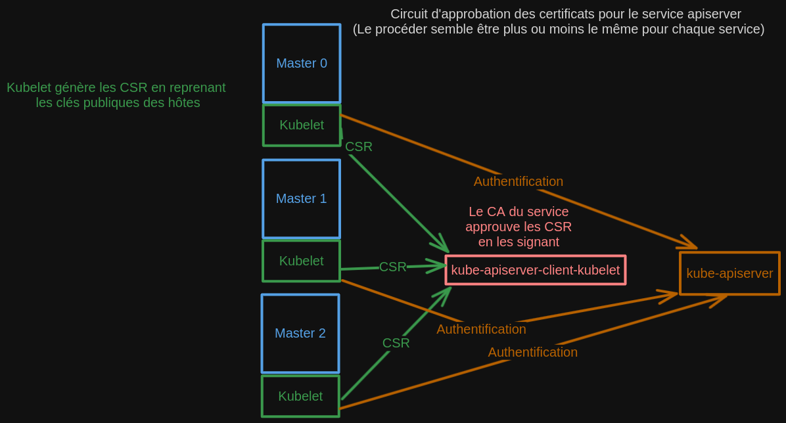

# Diagnostiquer et dépanner des certificats dans OKD

## Introduction

OKD est un système dont l'architecture est assez atypique à ce que l'on
connait acctuellement, tout est pensé et philosophé pour que celui-ci
soit résiliant, robuste, hautement disponnible, et évolutif.

Et par dessus l'ensemble de ces points attractifs, nous avons tout plein
de notion traitant de la sécurité en ce qui concerne l'échange sécurisé
au travers des différents services et des machines sur lequels se
trouvent ses services afin de s'assurer d'une conformité identitaire.

## Diagnostiquer l'ensemble des certificats du cluster

Il existe des tas de moyens mis à disposition par Redhat pour analyser
l'état des certificats sur un cluster. En fonction de l'incident survenu
sur le cluster, qu'il s'agisse d'un soucis d'intégration d'un noeud ou
encore d'un service non fonctionnel dans la liste de Cluster Opérator,
la résolution ne se fera pas de la même manière. Toutes les méthodes
sont bonnes à prendre.

Une première consiste à consulter les logs (de la colonne MESSAGE)
écrits par les opérateurs :

``` code
╰─> oc get co   
NAME                                       VERSION                          AVAILABLE   PROGRESSING   DEGRADED   SINCE   MESSAGE
authentication                             4.12.0-0.okd-2023-02-18-033438   True        False         False      4h16m   
baremetal                                  4.12.0-0.okd-2023-02-18-033438   True        False         False      98d     
cloud-controller-manager                   4.12.0-0.okd-2023-02-18-033438   True        False         False      98d     
cloud-credential                           4.12.0-0.okd-2023-02-18-033438   True        False         False      98d     
cluster-autoscaler                         4.12.0-0.okd-2023-02-18-033438   True        False         False      98d     
config-operator                            4.12.0-0.okd-2023-02-18-033438   True        False         False      98d     
console                                    4.12.0-0.okd-2023-02-18-033438   True        False         False      5d14h   
control-plane-machine-set                  4.12.0-0.okd-2023-02-18-033438   True        False         False      98d     
csi-snapshot-controller                    4.12.0-0.okd-2023-02-18-033438   True        False         False      98d     
dns                                        4.12.0-0.okd-2023-02-18-033438   True        False         False      98d     
etcd                                       4.12.0-0.okd-2023-02-18-033438   True        False         False      98d     
image-registry                             4.12.0-0.okd-2023-02-18-033438   True        False         False      98d     
ingress                                    4.12.0-0.okd-2023-02-18-033438   True        False         False      23h     
insights                                   4.12.0-0.okd-2023-02-18-033438   True        False         False      45d     
kube-apiserver                             4.12.0-0.okd-2023-02-18-033438   True        False         False      98d     
kube-controller-manager                    4.12.0-0.okd-2023-02-18-033438   True        False         False      98d     
kube-scheduler                             4.12.0-0.okd-2023-02-18-033438   True        False         False      98d     
kube-storage-version-migrator              4.12.0-0.okd-2023-02-18-033438   True        False         False      5d15h   
machine-api                                4.12.0-0.okd-2023-02-18-033438   True        False         False      98d     
machine-approver                           4.12.0-0.okd-2023-02-18-033438   True        False         False      98d     
machine-config                             4.12.0-0.okd-2023-02-18-033438   True        False         False      4h8m    
marketplace                                4.12.0-0.okd-2023-02-18-033438   True        False         False      98d     
monitoring                                 4.12.0-0.okd-2023-02-18-033438   True        False         False      5d17h   
network                                    4.12.0-0.okd-2023-02-18-033438   True        False         False      98d     
node-tuning                                4.12.0-0.okd-2023-02-18-033438   True        False         False      98d     
openshift-apiserver                        4.12.0-0.okd-2023-02-18-033438   True        False         False      4h8m    
openshift-controller-manager               4.12.0-0.okd-2023-02-18-033438   True        False         False      98d     
openshift-samples                          4.12.0-0.okd-2023-02-18-033438   True        False         False      98d     
operator-lifecycle-manager                 4.12.0-0.okd-2023-02-18-033438   True        False         False      98d     
operator-lifecycle-manager-catalog         4.12.0-0.okd-2023-02-18-033438   True        False         False      98d     
operator-lifecycle-manager-packageserver   4.12.0-0.okd-2023-02-18-033438   True        False         False      4h12m   
service-ca                                 4.12.0-0.okd-2023-02-18-033438   True        False         False      98d     
storage                                    4.12.0-0.okd-2023-02-18-033438   True        False         False      98d
```

Ne pas hésiter à faire des describe sur les nodes en erreur (il peut y
avoir des pistes sur des certificat erronés ou non approuvés) :

``` code
╰─> oc describe node/orchidee-hw8b4-master-0
...
Conditions:
  Type             Status  LastHeartbeatTime                 LastTransitionTime                Reason                       Message
  ----             ------  -----------------                 ------------------                ------                       -------
  MemoryPressure   False   Fri, 09 Jun 2023 16:13:54 +0200   Fri, 09 Jun 2023 12:00:45 +0200   KubeletHasSufficientMemory   kubelet has sufficient memory available
  DiskPressure     False   Fri, 09 Jun 2023 16:13:54 +0200   Fri, 09 Jun 2023 12:00:45 +0200   KubeletHasNoDiskPressure     kubelet has no disk pressure
  PIDPressure      False   Fri, 09 Jun 2023 16:13:54 +0200   Fri, 09 Jun 2023 12:00:45 +0200   KubeletHasSufficientPID      kubelet has sufficient PID available
  Ready            True    Fri, 09 Jun 2023 16:13:54 +0200   Fri, 09 Jun 2023 12:00:45 +0200   KubeletReady                 kubelet is posting ready status
```

Une solution tout en un pour récupérer la date d'expiration des
certificats :

``` code
╰─> echo -e "NAMESPACE\tNAME\tEXPIRY" && oc get secrets -A -o go-template='{{range .items}}{{if eq .type "kubernetes.io/tls"}}{{.metadata.namespace}}{{" "}}{{.metadata.name}}{{" "}}{{index .data "tls.crt"}}{{"\n"}}{{end}}{{end}}' | while read namespace name cert; do echo -en "$namespace\t$name\t"; echo $cert | base64 -d | openssl x509 -noout -enddate; done | column -t 

NAMESPACE   NAME    EXPIRY
openshift-apiserver-operator                      openshift-apiserver-operator-serving-cert           notAfter=Mar  1   16:05:28  2025  GMT
openshift-apiserver                               etcd-client                                         notAfter=Feb  27  15:47:59  2033  GMT
openshift-apiserver                               serving-cert                                        notAfter=Mar  1   16:05:26  2025  GMT
openshift-authentication-operator                 serving-cert                                        notAfter=Mar  1   16:05:36  2025  GMT
openshift-authentication                          v4-0-config-system-serving-cert                     notAfter=Mar  1   16:05:42  2025  GMT
openshift-cloud-credential-operator               cloud-credential-operator-serving-cert              notAfter=Mar  1   16:05:40  2025  GMT
openshift-cluster-csi-drivers                     ovirt-csi-driver-controller-metrics-serving-cert    notAfter=Mar  1   16:06:30  2025  GMT
openshift-cluster-machine-approver                machine-approver-tls                                notAfter=Mar  1   16:05:35  2025  GMT
openshift-cluster-node-tuning-operator            node-tuning-operator-tls                            notAfter=Mar  1   16:05:36  2025  GMT
openshift-cluster-node-tuning-operator            performance-addon-operator-webhook-cert             notAfter=Mar  1   16:05:33  2025  GMT
openshift-cluster-samples-operator                samples-operator-tls                                notAfter=Mar  1   16:09:09  2025  GMT
openshift-cluster-storage-operator                cluster-storage-operator-serving-cert               notAfter=Mar  1   16:05:41  2025  GMT
openshift-cluster-storage-operator                csi-snapshot-webhook-secret                         notAfter=Mar  1   16:05:34  2025  GMT
openshift-cluster-storage-operator                serving-cert                                        notAfter=Mar  1   16:05:26  2025  GMT
openshift-cluster-version                         cluster-version-operator-serving-cert               notAfter=Mar  1   16:05:26  2025  GMT
openshift-config-managed                          kube-controller-manager-client-cert-key             notAfter=Jul  2   03:33:44  2023  GMT
openshift-config-managed                          kube-scheduler-client-cert-key                      notAfter=Jul  2   03:33:45  2023  GMT
openshift-config-operator                         config-operator-serving-cert                        notAfter=Mar  1   16:05:27  2025  GMT
openshift-config                                  etcd-client                                         notAfter=Feb  27  15:47:59  2033  GMT
openshift-config                                  etcd-metric-client                                  notAfter=Feb  27  15:47:59  2033  GMT
openshift-config                                  etcd-metric-signer                                  notAfter=Feb  27  15:47:59  2033  GMT
openshift-config                                  etcd-signer                                         notAfter=Feb  27  15:47:59  2033  GMT
openshift-console-operator                        serving-cert                                        notAfter=Mar  1   16:16:16  2025  GMT
openshift-console-operator                        webhook-serving-cert                                notAfter=Mar  1   16:16:16  2025  GMT
openshift-console                                 console-serving-cert                                notAfter=Mar  1   16:16:44  2025  GMT
openshift-controller-manager-operator             openshift-controller-manager-operator-serving-cert  notAfter=Mar  1   16:05:37  2025  GMT
openshift-controller-manager                      serving-cert                                        notAfter=Mar  1   16:05:38  2025  GMT
openshift-dns-operator                            metrics-tls                                         notAfter=Mar  1   16:05:29  2025  GMT
openshift-dns                                     dns-default-metrics-tls                             notAfter=Mar  1   16:06:09  2025  GMT
openshift-etcd-operator                           etcd-client                                         notAfter=Feb  27  15:47:59  2033  GMT
openshift-etcd-operator                           etcd-operator-serving-cert                          notAfter=Mar  1   16:05:40  2025  GMT
openshift-etcd                                    etcd-client                                         notAfter=Feb  27  15:47:59  2033  GMT
openshift-etcd                                    etcd-peer-orchidee-hw8b4-master-0                   notAfter=Mar  1   16:05:26  2026  GMT
openshift-etcd                                    etcd-peer-orchidee-hw8b4-master-1                   notAfter=Mar  1   16:05:27  2026  GMT
openshift-etcd                                    etcd-peer-orchidee-hw8b4-master-2                   notAfter=Mar  1   16:05:26  2026  GMT
openshift-etcd                                    etcd-serving-metrics-orchidee-hw8b4-master-0        notAfter=Mar  1   16:05:27  2026  GMT
openshift-etcd                                    etcd-serving-metrics-orchidee-hw8b4-master-1        notAfter=Mar  1   16:05:27  2026  GMT
openshift-etcd                                    etcd-serving-metrics-orchidee-hw8b4-master-2        notAfter=Mar  1   16:05:26  2026  GMT
openshift-etcd                                    etcd-serving-orchidee-hw8b4-master-0                notAfter=Mar  1   16:05:27  2026  GMT
openshift-etcd                                    etcd-serving-orchidee-hw8b4-master-1                notAfter=Mar  1   16:05:27  2026  GMT
openshift-etcd                                    etcd-serving-orchidee-hw8b4-master-2                notAfter=Mar  1   16:05:26  2026  GMT
openshift-etcd                                    serving-cert                                        notAfter=Mar  1   16:05:39  2025  GMT
openshift-image-registry                          image-registry-operator-tls                         notAfter=Mar  1   16:05:31  2025  GMT
openshift-image-registry                          image-registry-tls                                  notAfter=Mar  1   16:16:25  2025  GMT
openshift-ingress-operator                        metrics-tls                                         notAfter=Mar  1   16:05:26  2025  GMT
openshift-ingress-operator                        router-ca                                           notAfter=Mar  1   16:06:53  2025  GMT
openshift-ingress                                 router-certs-default                                notAfter=Mar  1   16:06:54  2025  GMT
openshift-ingress                                 router-metrics-certs-default                        notAfter=Mar  1   16:06:53  2025  GMT
openshift-insights                                openshift-insights-serving-cert                     notAfter=Mar  1   16:05:27  2025  GMT
openshift-kube-apiserver-operator                 aggregator-client-signer                            notAfter=Jul  1   10:47:09  2023  GMT
openshift-kube-apiserver-operator                 kube-apiserver-operator-serving-cert                notAfter=Mar  1   16:05:33  2025  GMT
openshift-kube-apiserver-operator                 kube-apiserver-to-kubelet-signer                    notAfter=Mar  1   15:33:06  2024  GMT
openshift-kube-apiserver-operator                 kube-control-plane-signer                           notAfter=Jul  30  15:33:34  2023  GMT
openshift-kube-apiserver-operator                 loadbalancer-serving-signer                         notAfter=Feb  27  15:32:58  2033  GMT
openshift-kube-apiserver-operator                 localhost-recovery-serving-signer                   notAfter=Feb  27  16:05:06  2033  GMT
openshift-kube-apiserver-operator                 localhost-serving-signer                            notAfter=Feb  27  15:32:56  2033  GMT
openshift-kube-apiserver-operator                 node-system-admin-client                            notAfter=Sep  28  16:05:41  2023  GMT
openshift-kube-apiserver-operator                 node-system-admin-signer                            notAfter=Mar  1   16:05:06  2024  GMT
openshift-kube-apiserver-operator                 service-network-serving-signer                      notAfter=Feb  27  15:32:57  2033  GMT
openshift-kube-apiserver                          aggregator-client                                   notAfter=Jul  1   10:47:09  2023  GMT
openshift-kube-apiserver                          check-endpoints-client-cert-key                     notAfter=Jul  2   03:33:44  2023  GMT
openshift-kube-apiserver                          control-plane-node-admin-client-cert-key            notAfter=Jul  2   03:33:44  2023  GMT
openshift-kube-apiserver                          etcd-client                                         notAfter=Feb  27  15:47:59  2033  GMT
openshift-kube-apiserver                          etcd-client-17                                      notAfter=Feb  27  15:47:59  2033  GMT
openshift-kube-apiserver                          etcd-client-18                                      notAfter=Feb  27  15:47:59  2033  GMT
openshift-kube-apiserver                          etcd-client-19                                      notAfter=Feb  27  15:47:59  2033  GMT
openshift-kube-apiserver                          etcd-client-20                                      notAfter=Feb  27  15:47:59  2033  GMT
openshift-kube-apiserver                          etcd-client-21                                      notAfter=Feb  27  15:47:59  2033  GMT
openshift-kube-apiserver                          etcd-client-22                                      notAfter=Feb  27  15:47:59  2033  GMT
openshift-kube-apiserver                          etcd-client-23                                      notAfter=Feb  27  15:47:59  2033  GMT
openshift-kube-apiserver                          etcd-client-24                                      notAfter=Feb  27  15:47:59  2033  GMT
openshift-kube-apiserver                          etcd-client-25                                      notAfter=Feb  27  15:47:59  2033  GMT
openshift-kube-apiserver                          etcd-client-26                                      notAfter=Feb  27  15:47:59  2033  GMT
openshift-kube-apiserver                          etcd-client-27                                      notAfter=Feb  27  15:47:59  2033  GMT
openshift-kube-apiserver                          etcd-client-28                                      notAfter=Feb  27  15:47:59  2033  GMT
...
```

(source : <https://access.redhat.com/solutions/3930291>)

On peut venir récupérer l'ensemble de ces certificats dans un fichier
Certificates pour les comparer.

``` code
╰─> oc get secrets -A -o go-template='{{range .items}}{{if eq .type "kubernetes.io/tls"}}{{.metadata.namespace}}{{" "}}{{.metadata.name}}{{" "}}{{index .data "tls.crt"}}{{"\n"}}{{end}}{{end}}' | while read namespace name cert; do echo " "; echo -en "Namespace: $namespace\t\nCertificateName: $name\t\n";echo " "; echo $cert | base64 -d; done &> Certificates.txt
```

## Exemple de résolution d'un soucis de certificat (kubelet et kubeapiserver)

Si, comme dans le cas que j'ai rencontré, un des 3 noeuds Master à rendu
l'âme (qu'elle n'est pas prête) :

``` code
╰─> oc get nodes
NAME                          STATUS   ROLES                  AGE   VERSION
orchidee-hw8b4-master-0       Ready    control-plane,master   98d   v1.25.4+a34b9e9
orchidee-hw8b4-master-1       Ready    control-plane,master   98d   v1.25.4+a34b9e9
orchidee-hw8b4-master-2       Ready    control-plane,master   98d   v1.25.4+a34b9e9
orchidee-hw8b4-worker-mwr49   Ready    worker                 98d   v1.25.4+a34b9e9
orchidee-hw8b4-worker-nvcjf   Ready    worker                 98d   v1.25.4+a34b9e9
orchidee-hw8b4-worker-png59   Ready    worker                 98d   v1.25.4+a34b9e9
```

``` code
╰─> oc describe node/orchidee-hw8b4-master-0
...
Conditions:
  Type             Status  LastHeartbeatTime                 LastTransitionTime                Reason                       Message
  ----             ------  -----------------                 ------------------                ------                       -------
  MemoryPressure   False   Fri, 09 Jun 2023 16:13:54 +0200   Fri, 09 Jun 2023 12:00:45 +0200   KubeletHasSufficientMemory   kubelet has sufficient memory available
  DiskPressure     False   Fri, 09 Jun 2023 16:13:54 +0200   Fri, 09 Jun 2023 12:00:45 +0200   KubeletHasNoDiskPressure     kubelet has no disk pressure
  PIDPressure      False   Fri, 09 Jun 2023 16:13:54 +0200   Fri, 09 Jun 2023 12:00:45 +0200   KubeletHasSufficientPID      kubelet has sufficient PID available
  Ready            True    Fri, 09 Jun 2023 16:13:54 +0200   Fri, 09 Jun 2023 12:00:45 +0200   KubeletReady                 kubelet is posting ready status
...
Allocated resources:
  (Total limits may be over 100 percent, i.e., overcommitted.)
  Resource           Requests      Limits
  --------           --------      ------
  cpu                2199m (62%)   0 (0%)
  memory             7572Mi (51%)  0 (0%)
  ephemeral-storage  0 (0%)        0 (0%)
  hugepages-1Gi      0 (0%)        0 (0%)
  hugepages-2Mi      0 (0%)        0 (0%)
Events:              <none>
```

Kubelet n'était pas ready et ne postait plus de status. Ce qui fait que
kubelet était la cause principale de l'incident.

``` code
[core@orchidee-hw8b4-master-0 ~]$ journalctl -u kubelet -f
Jun 09 08:37:42 orchidee-hw8b4-master-0 kubenswrapper[835105]: E0609 08:37:42.146757  835105 kubelet_node_status.go:94] "Unable to register node with API server" err="nodes is forbidden: User \"system:anonymous\" cannot create resource \"nodes\" in API group \"\" at the cluster scope" node="orchidee-hw8b4-master-0"
```

Kubelet n'arrivait pas à intéragir avec l'api à cause de ses
certificats.

``` code
╰─> oc get csr        
NAME        AGE     SIGNERNAME                                    REQUESTOR                                                                   REQUESTEDDURATION   CONDITION
csr-2g5dz   10h     kubernetes.io/kube-apiserver-client-kubelet   system:serviceaccount:openshift-machine-config-operator:node-bootstrapper   <none>              Pending
csr-2qkm4   7h46m   kubernetes.io/kube-apiserver-client-kubelet   system:serviceaccount:openshift-machine-config-operator:node-bootstrapper   <none>              Pending
csr-2tknl   17h     kubernetes.io/kube-apiserver-client-kubelet   system:serviceaccount:openshift-machine-config-operator:node-bootstrapper   <none>              Pending
csr-4r7zf   3h38m   kubernetes.io/kube-apiserver-client-kubelet   system:serviceaccount:openshift-machine-config-operator:node-bootstrapper   <none>              Pending
csr-4zbdx   14h     kubernetes.io/kube-apiserver-client-kubelet   system:serviceaccount:openshift-machine-config-operator:node-bootstrapper   <none>              Pending
csr-52jts   13h     kubernetes.io/kube-apiserver-client-kubelet   system:serviceaccount:openshift-machine-config-operator:node-bootstrapper   <none>              Pending
csr-5568x   25m     kubernetes.io/kube-apiserver-client-kubelet   system:serviceaccount:openshift-machine-config-operator:node-bootstrapper   <none>              Pending
csr-55t65   10h     kubernetes.io/kube-apiserver-client-kubelet   system:serviceaccount:openshift-machine-config-operator:node-bootstrapper   <none>              Pending
csr-575dc   11h     kubernetes.io/kube-apiserver-client-kubelet   system:serviceaccount:openshift-machine-config-operator:node-bootstrapper   <none>              Pending
csr-5lpx4   13h     kubernetes.io/kube-apiserver-client-kubelet   system:serviceaccount:openshift-machine-config-operator:node-bootstrapper   <none>              Pending
csr-5rm5j   16h     kubernetes.io/kube-apiserver-client-kubelet   system:serviceaccount:openshift-machine-config-operator:node-bootstrapper   <none>              Pending
csr-66c6v   11h     kubernetes.io/kube-apiserver-client-kubelet   system:serviceaccount:openshift-machine-config-operator:node-bootstrapper   <none>              Pending
csr-6wsbv   12h     kubernetes.io/kube-apiserver-client-kubelet   system:serviceaccount:openshift-machine-config-operator:node-bootstrapper   <none>              Pending
csr-7tvkk   4h25m   kubernetes.io/kube-apiserver-client-kubelet   system:serviceaccount:openshift-machine-config-operator:node-bootstrapper   <none>              Pending
```

En faisant la commande de ce bloc de code, on s'apperçevait que de
nombreux certificats attendaient de se faire approuver. Pour se faire il
fallait simplement les approuver comme suit.

``` code
╰─> for cert in $(oc get csr| awk '{print $1}'); do 
  oc adm certificate approve $cert
done
```

## Fonctionnement global de l'approbation de certificat par OKD

Les certficats dans OKD contribuent à sécuriser les services entre eux
et de veiller à ce qu'ils ne s'empiètent pas les uns sur les autres. Ils
nous permettent de nous prémunir contre les attaquants mais aussi de
sécuriser les canals de communication.

Le schéma plus bas, est tiré de l'incident rencontré au point précédent.



Kubelet est le client qui s'addonne à l'authentification des noeuds
Master/Worker sur le cluster. Il génère les premiers certificats en vue
d'initialiser la communication vers l'api Kubernetes/OKD et enregistre
les noeuds dans le cluster. Sans passer par Kubelet, les noeuds ne
pourront pas devenir Ready. (**oc get node** → pour la description des
états des noeuds)

[Descriptif du schéma :]{.underline}

Le Cluster Opérateur posant problème dans le cluster était
"kube-apiserver". (directement lié à kubelet)

Pour chacune de nos nodes, Kubelet va créer un certificat et va tenter
d'intéragir avec le signataire (soit l'authorité de certification) de
façon à signer/approuver les certificats, pour les intégrer aux cluster.

Le signataire sera le Cluster Opérator lui même. (pas sûr)

On doit avoir un CA par service. (pas sûr, à vérifier)

/ ! \\ A savoir que les certificats sont générés par cluster opérateur
et par machine. Dans le cas du cluster opérator kube-apiserver, nous
retrouverons 3 certificats : 1 pour "Master 0", 1 pour "Master 1", puis
un autre pour "Master 2".
