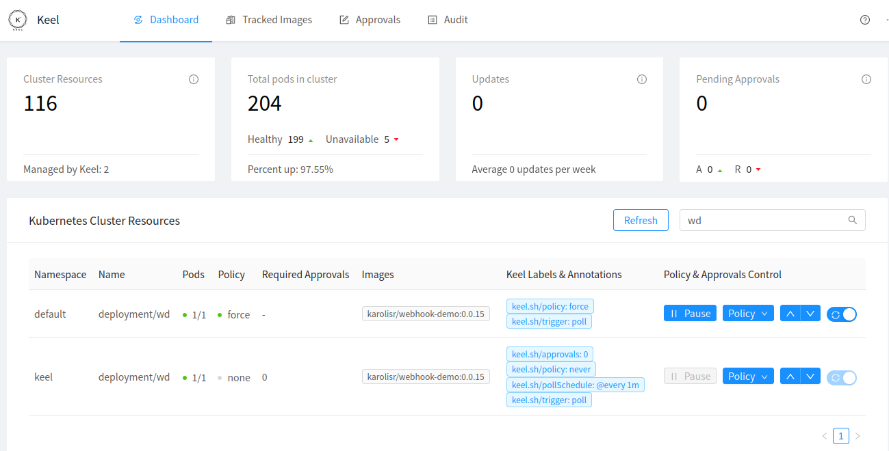

# OKD: Keel l\'équivalent de watchtower sous K8s

## Contexte

Dans un environnement `Docker`, `watchtower` est l\'outil qui permet de
détecter la mise à disposition d\'une nouvelle image applicative sur un
registry, en particulier `DockerHub`.

Sous `Kubernetes`, l\'outil ne peut pas être utilisé car il cherche à se
connecter un daemon `docker` qui n\'existe pas pour exécuter un fichier
`docker-compose.yml`

## Keel vs Deployment vs DeploymentConfig

Sous `OKD`, il existe deux façons de déployer une application:

-   DeploymentConfig

C\'est le format natif d\' `OpenShift` avant qu\'il introduise
`kubernetes` pour gérer l\'orchestration de container dans la branche
`4.X`

Le principe de fonctionnement de `dc` repose sur la notion d\'
`ImageStream` propre à `okd` qui consiste à définir une empreinte d\'un
registry externe sur lequel il indexe les versions et tags des images
(il ne les télécharge pas). Il est donc facile dans ce mode d\'intégrer
des `triggers` qui déclenchent le déploiement d\'une image à chaque fois
qu\'une nouvelle version est disponible sur le registry externe, souvent
DockerHub.

-   Deployment

C\'est la version native de `k8s`. La recommendation de RedHat dans la
doc OKD est d\'utiliser ce format qui apparaît comme en retard sur le
format `deployment` mais qui à terme a pour objectif d\'intégrer la
plupart des possibilités de `dc`. De ce fait, il n\'y a pas actuellement
de trigger natif sous k8s permettant de déclencher un redéploiement
suite à la présence d\'une nouvelle image, dans la mesure où l\'API k8s
n\'utilise pas nativement `ImageStream`.

De ce fait il faut adapter tous les usages natif de `DeploymentConfig` à
l\'utilisation avec `Deployment`:

1.  Création, Synchronisation d\'un Imagestream avec un registry distant
2.  Integration de Imagestream dans l\'API K8s
3.  Trigger de redéploiement de l\'application

### Création, Synchronisation d\'un Imagestream avec un registry distant

=\> [Concerne l\'objet ImageStream]{.underline}

<https://docs.openshift.com/container-platform/4.12/openshift_images/image-streams-manage.html>

Cependant cette fonctionnalité utilisant`ImageStream`, il faut qu\'il en
existe un au préalable, ce qui n\'est pas le cas par défaut lorsqu\'on
utlise `kompose` pour créer un deploy.

``` yaml
tee wd-is.yml <<EOF
apiVersion: image.openshift.io/v1
kind: ImageStream
metadata:
  creationTimestamp: null
  labels:
    app: keel
  name: keel
spec:
  lookupPolicy:
    local: false
  tags:
    - annotations: null
      from:
        kind: DockerImage
        name: docker.io/abesesr/theses:develop-api-diffusion
      generation: null
      importPolicy: {}
       #importMode: Legacy
       #scheduled: true
      name: develop-api-diffusion
      referencePolicy:
        type: ""
EOF | oc apply -f -
```

ou bien en CLI

``` bash
oc create imagestream theses-api-diffusion
oc create imagestreamtag theses:develop-api-diffusion --from-image=docker.io/abesesr/theses:develop-api-diffusion (--scheduled=true)
# ou bien
oc tag docker.io/abesesr/theses:develop-api-diffusion theses-api-diffusion:develop-api-diffusion --scheduled
```

Par défaut, la vérification avec le registry distant n\'est pas activée.
Pour ce faire, il faut rajouter le flag `--scheduled=true`

La vérification et l\'import de la nouvelle image le cas échéant se fera
alors toutes les 15 minutes et ce paramètre système n\'est pas
modifiable dans okd 4.

Les images sur docker.io peuvent être bloquées par un nombre de
tentatives sans compte. On peut enlever cette limite en s\'authentifiant
avec picabesesr

``` bash
oc create secret docker-registry docker.io --docker-server=docker.io --docker-username= --docker-password=
```

Et on lie le secret au SA default pour puller les images avec ce secret

``` bash
oc secrets link default docker.io --for=pull
oc get sa default -o yaml
```

### Intégration de Imagestream par l\'API K8s

<https://docs.openshift.com/container-platform/4.12/openshift_images/using-imagestreams-with-kube-resources.html>

#### Mise à disposition d\'un ImageStream aux resources K8s

=\> [Concerne l\'objet ImageStream]{.underline}

Par défaut, les pods vont se référer à l\'imagestream dans le cadre
d\'un dc, puisqu\'il s\'agit d\'une ressource native à OKD.

Dans le cas d\'un deployment non natif à k8s, si on veut que toutes les
resources kubernetes puissent se référer à un imagestream existant en
particulier (qualimarc-db-dumper), il faut l\'activer dans le deploy

``` bash
oc set image-lookup qualimarc-db-dumper --enabled=true
oc get is qualimarc-db-dumper
# renvoie;
  lookupPolicy:
    local: true
```

Vérification:

``` bash
oc set image-lookup imagestream --list
```

Si on ne veut pas utiliser une ImageStream:

``` bash
oc set image-lookup qualimarc-db-dumper --enabled=false
```

#### Mise à disposition de tous les ImageStream à un deploy

=\> [Concerne l\'objet Deploy]{.underline}

Si on veut qu\'un deploy en particulier puisse utiliser toutes les
ImageStreams de son choix:

``` bash
oc set image-lookup deploy/mysql
# renvoie
spec:
  replicas: 1
  template:
    metadata:
      annotations:
        alpha.image.policy.openshift.io/resolve-names: '*'
```

### Trigger de redéploiement de l\'application

=\> [Concerne l\'objet Deploy]{.underline}

<https://docs.okd.io/latest/openshift_images/triggering-updates-on-imagestream-changes.html>

En attendant que les développeurs de Kubernetes développent nativement
cette fonctionnalité, RedHat a intégré dans openshift un workaround pour
utiliser un trigger, se présentant sous forme d\'annotation à intégrer
dans le manifest `Deployment`. **Cela permet de déclencher un nouveau
deployment de l\'application quand l\'imagestream change.**

``` bash
oc set triggers deploy/theses-api-diffusion --from-image=theses-api-diffusion:develop-api-diffusion -c theses-api-diffusion
```

Cette commande a pour effet de rajouter la ligne au deploy

``` yaml
...
metadata
  annotation:
    image.openshift.io/triggers: '[{"from":{"kind":"ImageStreamTag","name":"theses-api-diffusion:develop-api-diffusion"},"fieldPath":"spec.template.spec.containers[?(@.name==\"theses-api-diffusion\")].image"}]
```

-   Keel

Si on ne veut pas utiliser les fonctionnalités natives de
`DeploymentConfig` ou adaptées de `Deployment` avec `ImageStream`, il
reste l\'option d\'utiliser `keel` avec `Deployment` qui s\'avère être
une très bonne solution puisqu\'il intègre une interface web.

**Attention: Keel ne fonctionnant pas avec le format `DeploymentConfig`
d\'OKD**, il faut déployer les applications professionnelles en format
`Deployment` sans l\'option `--provider openshift` de `kompose`:

``` bash
kompose -f docker-compose-resolved.yml convert
```

Ce qui aura pour effet de ne pas générer de fichier `ImageStream`

## Installation de Keel

<https://github.com/keel-hq/keel#configuration>
<https://keel.sh/docs/#additional-settings>

-   On commence par créer l\'environnement propice au projet:

``` bash
oc new-project keel
oc adm policy add-scc-to-user anyuid -z keel
```

-   Les manifests ne sont pas directement fournis, l\'application est
    distribuée sous forme de Helm charts:

``` bash
helm repo add keel https://charts.keel.sh
helm repo update
helm upgrade --install keel --namespace=keel keel/keel --set helmProvider.enabled="false"
```

-   On rajoute un secret docker

``` bash
oc create secret docker-registry docker.io --docker-server=docker.io --docker-username= --docker-password=
oc secrets link keel docker.io --for=pull
watch -d -n1 oc get pods
oc get sa default -o yaml
```

-   keel est fonctionnel mais sa plus-value réside dans l\'interface
    web. Il faut définir au miminum les variable de login et de mdp pour
    que l\'interface soit disponible:

``` bash
oc set env deployment.apps/keel BASIC_AUTH_USER=admin BASIC_AUTH_PASSWORD=password
```

-   On peut alors créer un service `clusterip`

``` bash
oc create service clusterip keel-ui --tcp 9300:9300
oc set selector service/keel-ui 'app=keel'
oc expose service/keel-ui
oc get route
```

## Paramétrage des Images à tracker

Les images à tracker se paramètrent dans leur fichier de déploiement
`Deployment` au moyen minimum de deux annotations:

``` yaml
...
  annotations:
    keel.sh/policy: minor # <-- policy name according to https://semver.org/
    keel.sh/trigger: poll # <-- actively query registry, otherwise defaults to webhooks
```

-   en CLI

``` bash
oc annotate deploy/wd keel.sh/policy=force keel.sh/trigger=poll keel.sh/policy=minor
```

-   Interface web:

On peut tout faire très intuitivement dans l\'interface au moyen des
boutons à droite de chaque `Deployment`



-   Règles de déploiement:

<https://keel.sh/docs/#policies>
